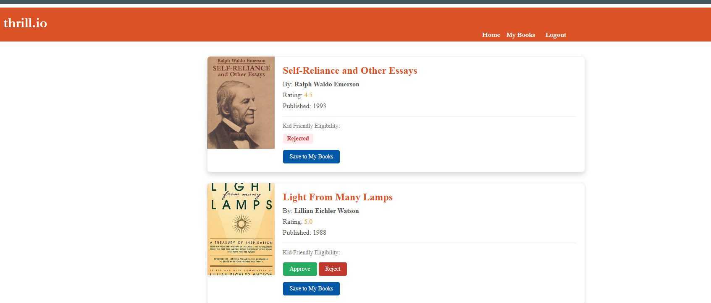
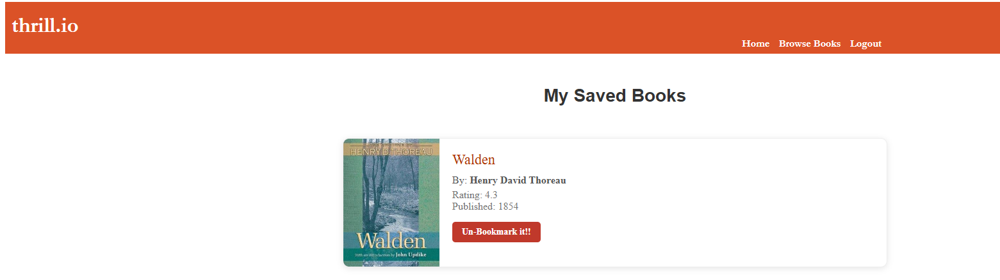
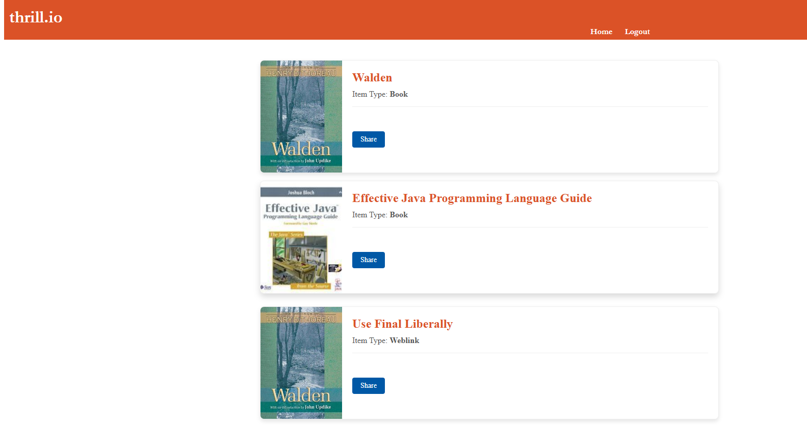

# thrill.io - Social Bookmarking Portal

Thrill.io is a Java-based web application designed to help users organize and share their favorite media. It allows users to bookmark books, movies, and web links while featuring a collaborative "Kid-Friendly" status review system.

## 🚀 Features

### 1. Centralized Dashboard
A clean, card-based navigation system to jump between Books, Movies, Web Links, and the Sharing portal.

### 2. Media Management
* **Books:** Browse a collection of literature with ratings and publication details.
* **Movies:** Keep track of films and documentaries.
* **Web Links:** Save useful articles and tools.

### 3. Personal Collections
Users can save items to their personal "My Books" or "My Movies" lists and "Un-bookmark" them at any time.

### 4. Community Moderation
Features an interactive "Kid Friendly Eligibility" system where users can **Approve** or **Reject** content based on age-appropriateness.

### 5. Sharing Feature
A dedicated module to share curated content with external partners.

## 🛠️ Tech Stack
* **Backend:** Java (Servlets & JSP)
* **Database:** MySQL (via JDBC/DAO Pattern)
* **Frontend:** HTML5, CSS3, JavaScript
* **Version Control:** Git

## 📂 Project Structure
Following the MVC architectural pattern:
- `src/main/java/controllers`: Request handling (e.g., `ShareController`)
- `src/main/java/entities`: Data models (Book, Movie, User)
- `src/main/java/dao`: Data Access Objects for database communication
- `src/main/webapp`: JSP pages and static assets (CSS/Images)

---
*Developed as a full-stack Java web application project.*
